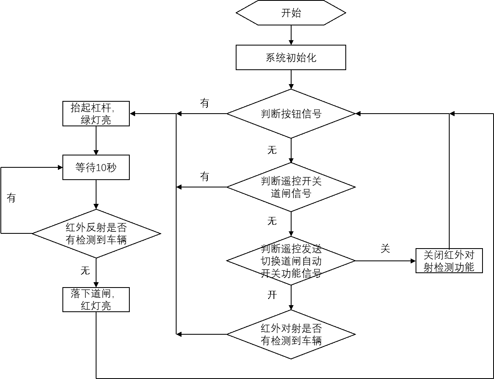
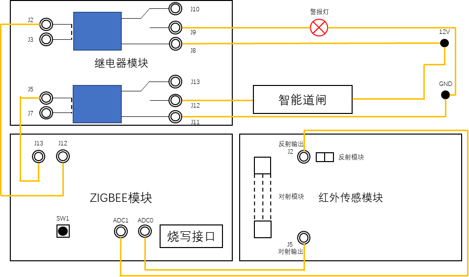

# 使用手册

>该项目为Zigbee门禁开发 
>
>开发环境基于[IAR Embedded Workbench for 8051](https://www.iar.com/products/architectures/iar-embedded-workbench-for-8051/#containerblock_3094)
>
>无需配置`basic_rf`包，已自动部署

使用到的**SENSOR**:
- 红外对射传感器
- 红外反射传感器

学术垃圾，纯属只是应付毕业

吃屎吧傻逼论文煞笔煞笔傻逼傻逼

# 抽象图

代码流程图:

整体链接图:

